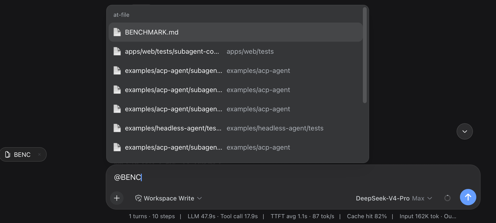

# dsh-at-file

Codex-style `@file` mentions for the DeepSeek Harness web GUI. Type `@` in the composer, search the workspace files (and directories) as you type, press Enter to attach, and the referenced content ships to the model when the message is sent.



```
composer:  fix the README  @README.  ← floating picker over the token
            ┌────────────────────────────┐
            │ 📄 README.md               │
            │ 📁 docs/                   │
            └────────────────────────────┘
draft:     fix the README [📄 README.md]  ← a chip showing the kind icon + basename
dock:      📄 README.md  ×               ← clickable link above the input
model:     fix the README @README.md     ← the full @path token at send time
           <file path="README.md">…content…</file>   ← injected at send time
```

Picking a row mints a chip: the draft holds a placeholder rendered as the basename (no long path overflow), and at send time the source's codec serializes the full `@path` token, which the Host expands into the file content at each agent's pre-step boundary. Attaching a directory expands to every file under it, recursively and bounded.

## Install

```sh
dsh plugin --profile web add https://github.com/omdsh-dev/dsh-at-file/archive/refs/heads/main.tar.gz
```

Restart the web server so the host half and the served client bundle pick up the plugin. The plugin needs the standard web bundle composition (the `ui-input-trigger` `@` pipeline, `api-gateway` client Remote, and the conversation slots) — the default `dsh web` profile has all of them.

The enable switch lives in **Settings → File mentions** (`at-file` settings namespace, exposed by a one-line harness allowlist entry).

## Configuration

Host-side tunables live on the plugin row in `cordis.yml`:

```yaml
- id: dsh-at-file
  name: dsh-at-file
  config:
    maxIndexedFiles: 5000      # hard cap on indexed entries per workspace (walk stops, reports truncation)
    maxFileBytes: 262144       # hard cap on one attached file; larger files are refused, never truncated
    ignoreDirs: ['.git', 'node_modules']   # directory basenames the walk skips
```

## Model experience

| Aspect | Effect |
| --- | --- |
| Token cost | One attached file adds its complete content (up to `maxFileBytes`) to the request; a directory adds each subtree file. |
| Tool calls | None — the content is already in the prompt; the model never calls a tool to read attached files. |
| Message format | Each file serializes as `<file path="<workspace-relative>">\n<content>\n</file>`; a directory as `<directory path="…">…</directory>`; injected as a user-role message with source `at-file-mention`. |
| Limits | Files over `maxFileBytes`, binary files, or paths escaping the workspace are skipped (the mention stays plain prose). |

## Permission boundary

- The picker only offers entries under the session's workspace (`.git`/`node_modules` skipped by default). The Host resolves `@path` tokens against the session's cwd and never follows `..` out of the workspace. Content expansion happens Host-side at the `agent/pre-step` boundary, only for `source.kind === 'user'` messages.
- `host.openPath` (the click-to-open action) is the harness's own loopback-pinned endpoint.

## Development

```sh
pnpm install            # links the sibling dsh checkout for build and tests
pnpm run check          # typecheck + tests + build
pnpm run test           # vitest (host fs/mention/runtime, client source/dock/section/apply)
pnpm run build          # esbuild host/client/invariant bundles + tsc declarations
```

The repo expects the harness checkout at `../dsh` for the dev-time `link:` resolutions and the test aliases.

## Known limitations

- The workspace index is cached per session for 30 seconds; files created later appear on the next menu open after that window.
- `@path` tokens may not contain whitespace or `@` (the token grammar is `@[^\s@]+`); a filename with spaces cannot be mentioned by typing.
- The picker group title renders the source name (`at-file`) because the slash menu's title dictionary is owned by the harness.

## License

MIT
